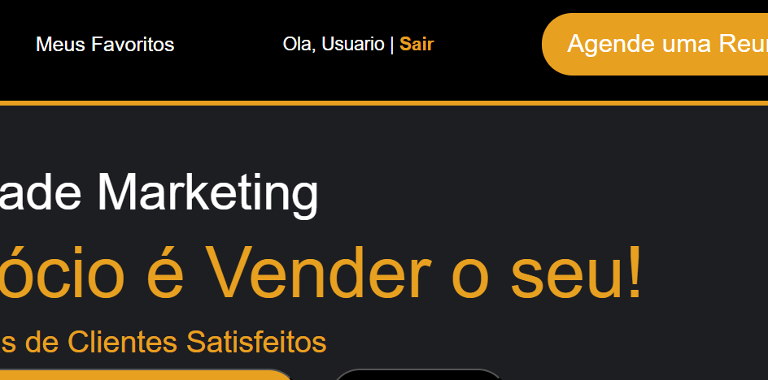
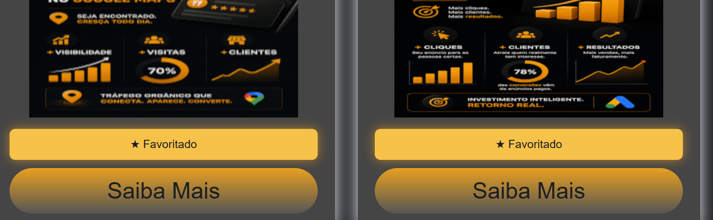
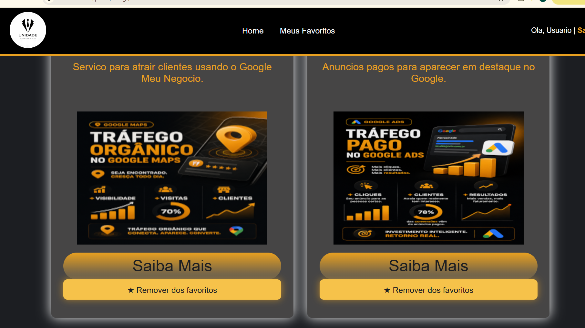

# Trabalho Pratico - Semana 15

## Personalizacao do site com integracao de login

Esta entrega integra login de usuario e favoritos por usuario ao site Unidade Marketing.

Para usar o modulo de login na home, foi incluido o script:

```html
<script src="./assets/js/login.js"></script>
```

## Informacoes Gerais

- Nome: Guilherme Luiz Santos Chebile
- Matricula: 908179

## Login de teste

- Login: admin | Senha: 123
- Login: user | Senha: 123

## Funcionalidades implementadas

- Area de login na home com link "Entrar" quando nao ha usuario logado.
- Exibicao de "Ola, nome | Sair" quando o usuario esta logado.
- Tela de login em `public/codigs/modulos/login/index.html`.
- Persistencia do usuario logado em `sessionStorage` usando `usuarioCorrente`.
- Botao de favoritar nos cards de servicos da home.
- Bloqueio de favoritos para visitantes sem login, com redirecionamento para a tela de login.
- Persistencia dos favoritos no `localStorage` com chave por usuario, no formato `favoritos_<idDoUsuario>`.
- Pagina `public/codigs/favoritos.html` listando apenas os servicos favoritados do usuario logado.

## Prints do trabalho

### Home mostrando usuario logado



### Card com servico favoritado



### Pagina Meus Favoritos


